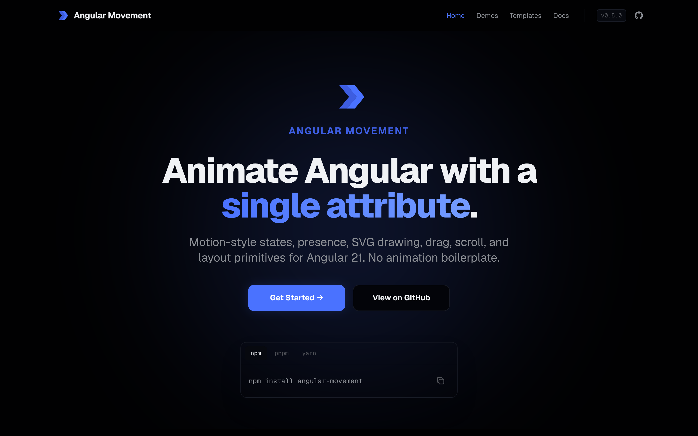
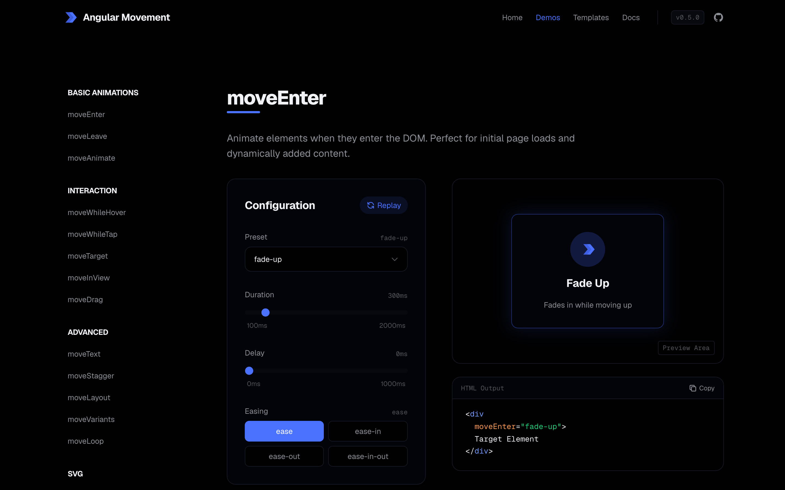

<div align="center">


# Angular Movement

### Animate Angular with a single attribute.

Declarative motion for **Angular 21 and 22** — presets, spring physics, drag, scroll, parallax,
presence orchestration & SVG path-drawing. SSR-safe. Zero `@angular/animations`. Standalone-ready.

<br/>

[](https://github.com/Andersseen/angular-movement/actions/workflows/ci.yml)
[](https://www.npmjs.com/package/angular-movement)
[](https://www.npmjs.com/package/angular-movement)
[](https://bundlephobia.com/package/angular-movement)
[](https://angular.dev)
[](LICENSE)
[](CONTRIBUTING.md)

<p>
  <a href="https://angular-movement.andersseen.dev"><b>🌐 Live Demo</b></a>
  &nbsp;·&nbsp;
  <a href="https://angular-movement.andersseen.dev/docs"><b>📚 Docs</b></a>
  &nbsp;·&nbsp;
  <a href="https://www.npmjs.com/package/angular-movement"><b>📦 npm</b></a>
  &nbsp;·&nbsp;
  <a href="ROADMAP.md"><b>🗺️ Roadmap</b></a>
</p>

<a href="https://angular-movement.andersseen.dev">
  
</a>

</div>

---

## Why Angular Movement?

UI animation in Angular tends to sprawl: enter/leave transitions rewritten per component,
imperative logic tangled into templates, inconsistent timings across a team, and no clean way
to orchestrate staggered lists or exit animations.

**Angular Movement** replaces that boilerplate with declarative directives and one global config,
so motion stays consistent, composable, and SSR-safe. Playback runs on the browser's native
**Web Animations API** (with an optional spring physics engine) — no `@angular/animations` setup required.

```html
<h2 [move]="'fade-up'">Hello movement</h2>
<button [moveWhileHover]="{ scale: [1, 1.05] }">Hover me</button>
```

## ✨ Features

|                                 |                                                                                          |
| ------------------------------- | ---------------------------------------------------------------------------------------- |
| 🎬 **30+ presets**              | fade, slide, zoom, flip, blur, bounce, pulse, spin, icon-draw/pulse/bounce               |
| 🧬 **Custom keyframes**         | full control when a preset isn't enough; `repeat` / `repeatType` / `repeatDelay`         |
| 🍃 **Spring physics**           | pre-computed spring keyframes via a dedicated engine                                     |
| 🖱️ **Interactions**             | hover, tap, focus, in-view, scroll, parallax, drag                                       |
| 🎯 **Advanced drag**            | axis-lock, constraints, elasticity, momentum, snap points & `moveWhileDrag`              |
| 👻 **Presence**                 | leave animations finish before removal — for a single view **or a keyed list**           |
| 🪜 **Stagger**                  | ordered list motion, plus `staggerChildren` orchestration inside variants                |
| ✍️ **SVG path drawing**         | animate `pathLength` / `pathOffset`, WAAPI-powered                                       |
| ⏱️ **Per-property transitions** | different duration, delay **and easing** per property; explicit keyframe `times`         |
| 🔀 **Motion values**            | derive motion from Angular **signals** (`moveValue`, `moveTransform`, `moveSpringValue`) |
| 🖥️ **SSR-safe**                 | every browser API guarded; no-ops on the server                                          |
| 🧱 **Standalone-ready**         | tree-shakeable directives, no NgModule required                                          |

## 🚀 Quick start

```bash
npm install angular-movement
# or: pnpm add angular-movement · yarn add angular-movement
```

> **Peer dependencies:** `@angular/core` and `@angular/common` — `^21.2.0 || ^22.0.0`.
> Every supported major is compiled against the packed package in CI (`pnpm validate:consumer`).

**1. Provide global defaults**

```ts
import { ApplicationConfig } from '@angular/core';
import { provideMovement } from 'angular-movement';

export const appConfig: ApplicationConfig = {
  providers: [
    provideMovement({
      duration: 320,
      easing: 'cubic-bezier(0.16, 1, 0.3, 1)',
      delay: 0,
      disabled: false,
    }),
  ],
};
```

**2. Import only the directives you use**

Standalone components tree-shake per route, but only if you import what you actually use — a
directive that's never imported anywhere never ships.

```ts
import { Component } from '@angular/core';
import { MoveAnimateDirective, MoveHoverDirective } from 'angular-movement';

@Component({
  selector: 'app-demo-card',
  standalone: true,
  imports: [MoveAnimateDirective, MoveHoverDirective],
  template: `
    <h2 [move]="'fade-up'">Hello movement</h2>
    <button [moveWhileHover]="{ scale: [1, 1.05] }">Hover me</button>
  `,
})
export class DemoCardComponent {}
```

> `MOVEMENT_DIRECTIVES` (all 21, spread into `imports`) is still exported as a convenience for
> prototyping or a component that genuinely uses most of the library — just know it pulls in
> everything, including directives that component doesn't use.

## 🧩 Pick the right primitive

Start with the smallest primitive that matches the job:

| Level               | Reach for                                                                    |
| ------------------- | ---------------------------------------------------------------------------- |
| **Basic**           | `moveEnter`, `moveLeave`, `[move]`, `moveInitial`, `moveAnimate`, `moveExit` |
| **Interactions**    | `moveWhileHover`, `moveWhileTap`, `moveWhileFocus`, `moveInView`             |
| **State**           | `moveVariants`, `moveTarget`, `moveTrigger`                                  |
| **Orchestration**   | `movePresence`, `moveStagger`                                                |
| **Scroll & layout** | `moveScroll`, `moveParallax`, `moveLayout`, `moveSmoothScroll`               |
| **Advanced**        | `pathLength`, `pathOffset`, `transition`, `spring`, `moveDrag`               |

> `moveLeave` plays only while a parent `movePresence` keeps the view alive during removal.
> A plain `@if` removes the element immediately, so there is no node left to animate.

Several of these look interchangeable at first glance. They're not — each covers a distinct job:

- **`[move]` / `moveAnimate` vs `[moveAnimation]`.** Both describe a single element's own
  enter/leave. `[move]`/`moveAnimate` take a preset name or `MoveKeyframes` pairs
  (`{ opacity: [0, 1] }`); `[moveAnimation]` takes Framer-style single-value state objects
  (`{ initial, animate, exit }`) and is reactive to `animate` changing. Reach for
  `[moveAnimation]` when you're already thinking in `initial`/`animate`/`exit` state, otherwise
  `[move]` is the simpler default.
- **`moveVariants` vs `moveTarget`/`moveTrigger`.** `moveVariants` propagates a named state down
  through DI to nested `[moveVariants]` children — the tool for a **shared** state (`idle`,
  `open`, `active`) driving a subtree, with `staggerChildren`/`delayChildren`/`when`
  orchestration. `moveTarget`/`moveTrigger` (experimental) instead connect two elements that do
  **not** share a parent — a boolean signal flips an animation on a target elsewhere in the DOM,
  with no DI propagation. Prefer `moveVariants` whenever the elements involved share an ancestor.
- **`moveStagger` vs `staggerChildren`.** `[moveStagger]` delays its **direct** animated children
  in DOM order — the tool for a flat list. `staggerChildren` (a `moveVariants` state property)
  staggers **nested `[moveVariants]` subtrees** on a variant change — the tool when the staggered
  items are themselves stateful, not just entering once.

## 🎛️ Explore the interactive playground

Every directive has a focused page with a live config panel and copy-paste HTML output.

<div align="center">
  <a href="https://angular-movement.andersseen.dev/demos">
    
  </a>
</div>

**Demo pages:** Animate · Animation (object API) · Enter & Leave · Hover & Tap · Focus · In-View ·
Scroll & Parallax · Presence · Layout · Drag · Variants · Text · SVG Icons

## 📖 Recipes

<details>
<summary><b>Motion-style API — <code>initial</code> / <code>animate</code> / <code>exit</code></b></summary>

<br/>

```html
<ng-container *movePresence="isOpen">
  <article
    [moveInitial]="{ opacity: 0, y: 24 }"
    [moveAnimate]="{ opacity: 1, y: 0 }"
    [moveExit]="{ opacity: 0, y: -16 }"
    moveDuration="300"
  >
    Card
  </article>
</ng-container>
```

The object form `[moveAnimation]="{ initial, animate, exit }"` is also available for config-heavy cases.

</details>

<details>
<summary><b>Drag gestures — constraints, momentum, snap points</b></summary>

<br/>

```html
<div
  moveDrag="x"
  [moveDragConstraints]="{ left: -120, right: 120 }"
  [moveDragElastic]="0.35"
  [moveDragMomentum]="true"
  [moveDragSnapPoints]="[{ x: -120, y: 0 }, { x: 0, y: 0 }, { x: 120, y: 0 }]"
  (moveDragStart)="onDragStart($event)"
  (moveDragMove)="onDragMove($event)"
  (moveDragEnd)="onDragEnd($event)"
>
  Drag me
</div>
```

Use `moveWhileTap` for press feedback that returns on release; use `moveDrag` when the element
should follow the pointer and keep a real position.

</details>

<details>
<summary><b>SVG path drawing & icon helpers</b></summary>

<br/>

Animate `pathLength` from `0` to `1` to draw a stroke. The engine measures the element's total length
and converts it to WAAPI-compatible `strokeDasharray` / `strokeDashoffset` keyframes.

```html
<svg width="24" height="24" viewBox="0 0 24 24">
  <path
    [moveTarget]="animate()"
    [moveFrames]="{ pathLength: [0, 1], opacity: [0, 1] }"
    moveDuration="700"
    fill="none"
    stroke="currentColor"
    stroke-width="2"
    d="M4 12l4-4 4 4 8-8"
  />
</svg>
```

Helper functions build icon keyframes quickly:

```ts
import { movePathDraw, moveIconPulse } from 'angular-movement';
```

```html
<svg [moveTarget]="animate()" movePreset="icon-bounce" moveDuration="500">
  <!-- icon paths -->
</svg>
```

</details>

<details>
<summary><b>Variants with per-property transitions</b></summary>

<br/>

Declare target states like Framer Motion. Use `moveVariant` to set the active state;
`moveActiveVariant` is a permanent, fully-supported alias for the same input (`@deprecated` only to
signal which name to prefer — it is not going away). When the active variant changes, keyframes
are generated from the previous state to the next.

```html
<div
  [moveVariants]="{
    idle: { scale: 1, rotate: 0 },
    active: { scale: 1.08, rotate: 4 }
  }"
  [moveVariant]="isActive ? 'active' : 'idle'"
>
  Card
</div>
```

Override timing per property, and point `moveExitVariant` at the variant that plays before removal:

```html
<ng-container *movePresence="isOpen">
  <aside
    [moveVariants]="{
      visible: { opacity: 1, x: 0 },
      hidden: { opacity: 0, x: 24 }
    }"
    moveVariant="visible"
    moveExitVariant="hidden"
  >
    Panel
  </aside>
</ng-container>
```

</details>

<details>
<summary><b>Motion values driven by signals</b></summary>

<br/>

Called from a field initializer or constructor of a class Angular itself constructs — a
component, directive, or service — `moveSpringValue` infers its injector automatically, the same
convention `toSignal`/`toObservable` use:

```ts
import { Component, computed } from '@angular/core';
import { moveSpringValue, moveTransform, moveValue } from 'angular-movement';

@Component({ selector: 'app-card', template: `...` })
class CardComponent {
  progress = moveValue(0);
  x = moveTransform(this.progress, [0, 1], [0, 120]);
  scale = moveSpringValue(moveTransform(this.progress, [0, 1], [0.9, 1]));
  transform = computed(() => `translateX(${this.x()}px) scale(${this.scale()})`);
}
```

Calling it from outside an injection context (a plain function invoked later, a different
injector than the surrounding one) still needs an explicit `injector`:

```ts
import { inject, Injector } from '@angular/core';
import { moveSpringValue } from 'angular-movement';

function buildScale(source: Signal<number>, injector: Injector) {
  return moveSpringValue(source, { injector });
}
```

`moveSpringValue` also respects `prefers-reduced-motion` automatically, same as every directive —
under reduced motion it jumps straight to the target value instead of animating.

Scroll directives expose progress as a signal, so you can derive values without a manual scroll loop:

```html
<section
  #scroll="moveScroll"
  [moveScroll]="{ opacity: [0, 1] }"
  [style.--progress]="scroll.progress()"
>
  Scroll-linked content
</section>
```

</details>

## 🧪 API stability

| Status               | APIs                                                                                                                                                                                                                                                                                                                                                                                                                                    |
| -------------------- | --------------------------------------------------------------------------------------------------------------------------------------------------------------------------------------------------------------------------------------------------------------------------------------------------------------------------------------------------------------------------------------------------------------------------------------- |
| **Stable**           | `provideMovement`, `MOVEMENT_DIRECTIVES`, `[move]`, `[moveAnimate]`, `moveEnter`, `moveLeave`, `*movePresence`, `moveStagger`, `moveWhileHover`, `moveWhileTap`, `moveWhileFocus`, `moveInView`, `moveScroll`, `moveParallax`, `[moveAnimation]`, `*movePresenceFor`, `moveVariants`, `moveText`, `moveLoop`, `MoveAnimator`, `moveValue`, `moveTransform`, `moveSpringValue`, the preset library (`MOVE_PRESETS` and the icon helpers) |
| **Stable candidate** | _(none currently — the 1.0 freeze pass promoted every candidate; new APIs may land here first)_                                                                                                                                                                                                                                                                                                                                         |
| **Experimental**     | `moveLayout`, `moveDrag` (the whole directive — constraints, momentum, snap points, `moveWhileDrag`), `moveSmoothScroll` / `SmoothScrollService`, `moveTarget`, `moveTrigger`                                                                                                                                                                                                                                                           |

Stable APIs follow semantic-versioning expectations. Candidate APIs are feature-complete but may
receive small naming or behavior adjustments. Experimental APIs can change significantly between
minor versions — see the versioning policy below for exactly what that means going into `1.x`.

Every exported type mirrors the stability of the API it supports — `MoveKeyframes` is stable
because the directives that take it are stable, `MoveDragEvent` is experimental because
`moveDrag` is. `AnimationControls` (the return type shared by `MoveAnimator` and every directive
internally) and the `MovementConfig` family (behind `provideMovement`) are stable on their own:
their shape hasn't changed since 0.5 and both are load-bearing for everything else.
`moveActiveVariant` is `@deprecated` in favor of `moveVariant` (same value, one name) but stays a
permanent, fully-supported alias — it will not be removed without a major version.

Each level is also declared in the source as a `@stability` JSDoc tag (`stable` / `candidate` /
`experimental`), so your editor shows the guarantee at the point of use — check the tag on the
specific declaration you're using for the authoritative answer. Experimental declarations
additionally carry the standard `@experimental` tag.

### Experimental compatibility policy (going into `1.x`)

There is no secondary `angular-movement/experimental` entry point — every experimental export
ships from the same package. This is the one deliberate exception to normal SemVer:

- Experimental exports **may change or be removed in any `1.x` minor**, including breaking
  changes to inputs, outputs, or behavior — the same convention Angular CDK uses for its own
  experimental APIs.
- Every experimental-only breaking change is called out under its own `### Changed (experimental)`
  CHANGELOG heading, separate from the normal `### Changed`, so you can safely ignore it if you
  don't use experimental APIs.
- Where practical, an experimental API gets a deprecation warning (dev-mode console warning or
  `@deprecated` tag) for at least one minor version before removal.

If you only use `[move]`, `moveVariants`, `*movePresenceFor`, `moveScroll`, and the rest of the
**Stable** row above, normal SemVer applies to your app without exception.

## 🔄 Input reactivity

Two deliberate groups, frozen for 1.0:

- **Reactive** — changing an input while the directive is alive updates or replays the animation:
  `moveWhileHover`, `moveWhileTap`, `moveWhileFocus`, `moveVariants`, `moveTarget`, `moveTrigger`,
  `moveScroll`, `moveParallax`, `moveDrag`, `moveLoop`, `moveText`, and `[moveAnimation]`'s
  `animate` state.
- **One-shot by design** — these describe a single entrance or exit, so they play once and ignore
  later input changes: `moveAnimate` / `[move]`, `moveEnter`, `moveLeave`, `moveInView`,
  `moveSmoothScroll`. To play one again, wrap the element in `*movePresence` / `*movePresenceFor`
  or re-create the view.

`[moveAnimation]` compares its `animate` state **by value**, so binding an object literal straight
in the template does not replay the animation on every change detection pass.

## 🏗️ Repository structure

This is a **pnpm monorepo** with two parts:

| Path                                     | What                                                                                 |
| ---------------------------------------- | ------------------------------------------------------------------------------------ |
| [`projects/movement`](projects/movement) | The publishable npm library (`angular-movement`)                                     |
| [`src`](src)                             | Demo & documentation site — [AnalogJS](https://analogjs.org/) (Vite + SSR, zoneless) |

The demo site imports the library via a Vite path alias, so library changes are reflected live
without a build step.

```bash
pnpm dev            # run the demo site
pnpm test           # library unit tests (Vitest)
ng build movement   # build the library → dist/movement
pnpm build          # build the demo site (client + SSR)
```

## 🚢 Deployment

The demo site deploys to **Cloudflare Pages** — a single source of truth for hosting.

- **Automatic:** every push to `main` runs [`.github/workflows/deploy-cloudflare.yml`](.github/workflows/deploy-cloudflare.yml).
- **Manual:** `pnpm deploy` builds and ships `dist/analog/public` via Wrangler.

Live at **[angular-movement.andersseen.dev](https://angular-movement.andersseen.dev)**.

## 🤝 Contributing

Contributions are welcome through issues and pull requests. When proposing changes, include a
problem statement, any public-API impact, and tests or demo updates for new behavior.

- 📋 [Contributing guide](CONTRIBUTING.md)
- 🤝 [Code of conduct](CODE_OF_CONDUCT.md)
- 🔒 [Security policy](SECURITY.md)
- 🗺️ [Roadmap](ROADMAP.md)
- ✅ [Release checklist](RELEASE_CHECKLIST.md)

## 📄 License

[MIT](LICENSE) © [Andersseen](https://github.com/Andersseen)

<div align="center"><sub>Built with Angular, AnalogJS & the Web Animations API.</sub></div>
